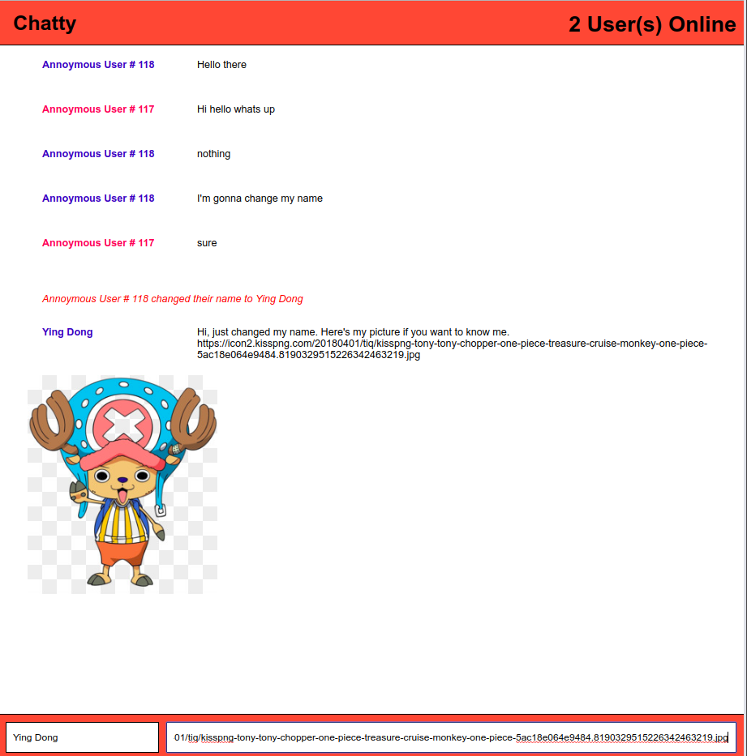

# Project: Chatty App

## Contributor: [Ying Dong](https://github.com/dongyingname)

## Overview:
This online chat app was created to simulate an online chat interface where users can interat with each other by creating messages and sending images.
- Each user is assigned of a unique color; when a username(optional) is entered the username will be in that unique color. A notification alert will show if a user changes the username.
- The number of users that are being connected is shown on the top-right corner of the page.
- Hit "Enter" while in the message area to send a message.
- Hit "Enter" while in the username area to change the username.
- No registration required!
- User-friendly interface: Clean interface and no advertisement!
- Shows number of users and usernames(optional) in colors.
- Compatible with URLs images in PNG, JPEG, and GIF format.

## Getting Started

The project contains 2 major directories:
- chatApp 
- chatty_server (WebSocket)

To install all the dependencies.

```
$npm install
```
in each of the chatApp and chatty_server directory.

To run the web server run the following command in terminal:

```
$npm start
```
in a sperated terminal in each of the chatApp and chatty_server directory.

- To view the ChattyApp page go to http://localhost:3000/.

## Final Product



## Tech Stack

- CSS/SCSS
- babel
- Node
- React with JSX
- Webpack
- WebSocket
- Express
## Contributo Information

- [Ying Dong](https://github.com/dongyingname)
- 2-Month web design experience.
- Currently a Lighthouse Lab student.


